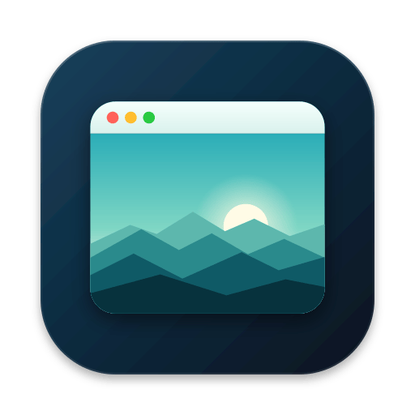
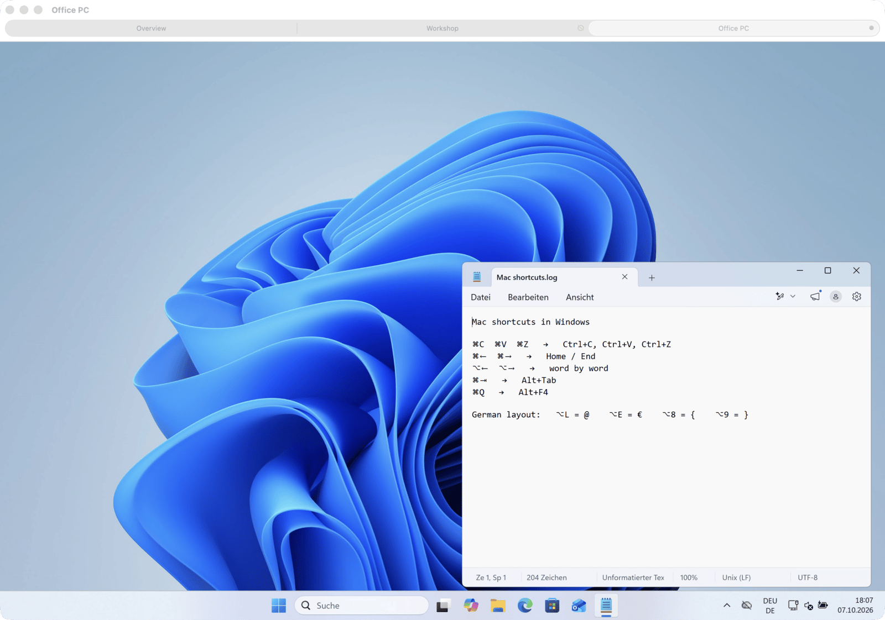

<p align="center">
  
</p>

<h1 align="center">Weitblick Remote</h1>

<p align="center">
  <strong>Remote Desktop for Windows PCs, made for the Mac. Your Mac shortcuts just work.</strong><br>
  A free, open-source RDP client for macOS, built on FreeRDP.
</p>

<p align="center">
  <a href="https://github.com/mneuhaus/weitblick-remote/releases/latest/download/Weitblick-Remote.dmg"><strong>Download (DMG)</strong></a> ·
  <a href="https://github.com/mneuhaus/weitblick-remote/releases/latest/download/Weitblick-Remote.zip">ZIP</a> ·
  <a href="https://github.com/mneuhaus/weitblick-remote/releases">All releases</a> ·
  <a href="https://mneuhaus.github.io/weitblick-remote/">Website</a>
  <br>
  <sub>macOS 14 Sonoma or later · Apple Silicon · English and German interface · Apache-2.0</sub>
</p>

<p align="center">
  
</p>

## Features

- **Mac shortcuts translated like Jump Desktop:** ⌘C/V/X/Z become Ctrl shortcuts, ⌘←/→ is Home/End, ⌥←/→
  jumps by word, ⌘⇥ is Alt+Tab, ⌘Q is Alt+F4. Or switch a connection to “Windows 1:1”.
- **German and international layouts:** the session uses your Mac’s layout; ⌥ symbols such as @ € { } [ ] | \ ~
  arrive as typed, dead keys compose as on the Mac.
- **Clipboard in both directions:** text, HTML, RTF, images, and files or whole folders (up to 2 GB per copy).
- **Native tabs:** an overview tab plus one tab per session; drag a tab out for its own window.
- **Folder sharing, audio, printers:** Mac folders as drives, sound on the Mac or the PC, Mac printers in Windows,
  optional microphone.
- **Auto-reconnect** to the same Windows session after a network drop.
- **Jump Desktop import** on first start (with preview), again any time from the File menu; `.rdp` files open too.
- **Keychain:** passwords are stored in the macOS Keychain, on this Mac only.
- **Certificate trust:** see the fingerprint once, trust it permanently, get warned when it changes.
- **Wake-on-LAN** from the connection’s context menu.
- **Retina:** full-resolution sessions that follow the window size.
- **Older Windows:** NLA can be switched off per connection; TLS 1.0 and classic RDP security as fallbacks.

## Install

The app is ad-hoc signed and **not notarized** (no paid Apple Developer account; this is a free project, and the
source and release build script are public). macOS asks you to confirm it once:

1. Open the DMG and drag **Weitblick Remote** into Applications, then open the app.
2. macOS blocks it (“Weitblick Remote” Not Opened). Click **Done**.
3. Open **System Settings → Privacy & Security**, scroll to **Security**, click **Open Anyway** next to the
   note about Weitblick Remote, and confirm with **Open Anyway** and your password or Touch ID.

Terminal alternative:

```sh
xattr -dr com.apple.quarantine "/Applications/Weitblick Remote.app"
```

On macOS 14 you can also Control-click the app and choose **Open**.

Permissions: macOS asks for **Local Network** access the first time you connect to a PC in your network (allow it,
or connections fail with “host unreachable”). Optional: **Accessibility** (to pass ⌘⇥, ⌘Space and ⌃←/→ to Windows)
and **Microphone** (only when enabled for a connection). Because of the ad-hoc signature, macOS asks again for
Accessibility, the microphone and Keychain access after each update.

## Keyboard

Default rules in the “Mac shortcuts” mode (add ⇧ to the navigation shortcuts to select). The full table is on the
[website](https://mneuhaus.github.io/weitblick-remote/#keyboard).

| On the Mac | In Windows |
| --- | --- |
| ⌘ + key (⌘C, ⌘V, ⌘X, ⌘Z, ⌘A, ⌘S …) | Ctrl + the same key |
| ⌘⇧Z | Ctrl+Y |
| ⌘← / ⌘→ · ⌘↑ / ⌘↓ | Home / End · Ctrl+Home / Ctrl+End |
| ⌥← / ⌥→ · ⌥⌫ | Ctrl+← / Ctrl+→ · Ctrl+Backspace |
| ⌘⌫ / ⌘⌦ | delete to line start / end |
| ⌘⇥ (keep ⌘ held) | Alt+Tab |
| ⌘Q | Alt+F4 |
| ⌘Space · ⌘ tapped alone | Windows key |
| ⌥⌘Esc | Ctrl+Shift+Esc |
| ⌃⌥⌫ | Ctrl+Alt+Del |
| ⌘[ / ⌘] | Alt+← / Alt+→ |
| ⌥ + key | the character your Mac layout types (@ € [ ] { } …), otherwise Alt + key |

Stays on the Mac: ⌃⌘F (full screen) and ⌃⌥⌘ shortcuts (tabs). ⌘⇥, ⌘Space and ⌃←/→ reach Windows only with the
Accessibility permission (default: in full screen). In “Windows 1:1” mode, ⌘ is the Windows key, ⌥ is Alt and ⌃ is
Ctrl.

## Privacy

No telemetry, no analytics, no account, no cloud. The app only connects to the computers you add. Connections are
stored in `~/Library/Application Support/Weitblick Remote/connections.json`, passwords in the login Keychain (this
Mac only, not synced).

## Known limits

No RD Gateway, multi-monitor or H.264 yet; sign-in with user name and password only (no Kerberos, smart cards or
Entra ID); files via copy and paste, not drag and drop; Mac printers need the “Microsoft Print to PDF” driver on the
PC; read-only shared folders are not supported; Apple Silicon only. VNC entries open macOS Screen Sharing.

## Building from source

```sh
git clone --recurse-submodules https://github.com/mneuhaus/weitblick-remote.git
cd weitblick-remote
brew install cmake ninja xcodegen openssl@3
scripts/build.sh Release
```

Needs Xcode 26. Release packaging (DMG, ZIP, signing) is described in [docs/RELEASING.md](docs/RELEASING.md); the
design and its history are in [docs/SPEC.md](docs/SPEC.md) and [docs/worklog/](docs/worklog/).

## Credits

- [FreeRDP](https://www.freerdp.com/) – the RDP protocol implementation (Apache License 2.0)
- [OpenSSL](https://www.openssl.org/) – TLS and cryptography (Apache License 2.0)
- Full list and license texts: [THIRD_PARTY_NOTICES.md](THIRD_PARTY_NOTICES.md)

Windows and Remote Desktop are trademarks of Microsoft; Jump Desktop is a product of Phase Five Systems. This project
is not affiliated with either.

## License

[Apache License 2.0](LICENSE). © 2026 Marc Neuhaus.
